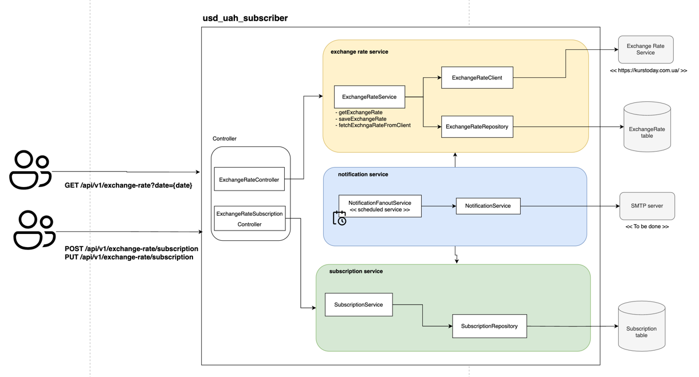

### Task Description

- implement API/Service for retrieving exchange rate for UAH - USD
- implement API/Service for email subscription for daily exchange rate changes

### Tech stack

- kotlin (service laguage)
- postgresSQL (database)
- flyway (database migration)
- spring (di/ioc container)
- spring boot, mvc, data, mail (web server, communication with database, email notifications)
- docker (service containerisation)
- junit, mockito, assertj (testing)

API for getting exchange rate: https://kurstoday.com.ua/en

### Architecture overview



### Endpoints

| Endpoint                         | Method | URL                 |
|----------------------------------|--------|---------------------|
| Get Exchange Rate                | `GET`  | `/api/v1/exchange-rate?date={date}`      |
| Add user subscription by email   | `POST` | `/api/v1/exchange-rate/subscription` |
| Change user sucbscription status | `PUT`  | `/api/v1/exchange-rate/subscription`   |


### How to run

In the project exists `Dockerfile`(with building and creating service container) and docker-compose.yml(for composing service run with a database).

It's possible to run the service straight a way with docker-compose by:
```docker
./docker-compose up
```
And then call for example such API:
``
http://localhost:8080/api/v1/exchange-rate
``

### Furthest improvements
- add security on web apis
- implement email sender with smtp server
- look for currency exchange webhook to rid of scheduler
- extend with logging and monitoring 
- extend retrieving exchange rate for other currencies
